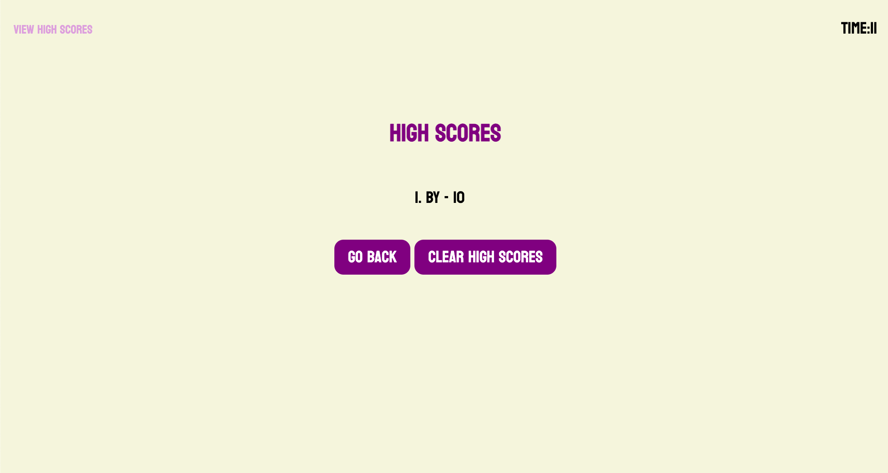

# quick-ticket
# Web APIs Challenge: Code Quiz

## Description
This coding quiz gives the user a set of questions related to basic coding terminology and facts. The quiz is broken down into 4 stages; The introduction, the question container, the quiz completion screen and final high score list screen. The user is given a timer at the top right corner. When the user answers the question wrong then 10 seconds are subtracted from said timer. At quiz completion the user is presented with their score and a form to enter their initials. Their score and initials are then saved using local storage. It's important to note that the user's score is based off of how much time is left on quiz completion.

## User Story
AS A coding boot camp student
I WANT to take a timed quiz on JavaScript fundamentals that stores high scores
SO THAT I can gauge my progress compared to my peers

## Acceptance Criteria
GIVEN I am taking a code quiz
WHEN I click the start button
THEN a timer starts and I am presented with a question
WHEN I answer a question
THEN I am presented with another question
WHEN I answer a question incorrectly
THEN time is subtracted from the clock
WHEN all questions are answered or the timer reaches 0
THEN the game is over
WHEN the game is over
THEN I can save my initials and score

### ToDo
-   Set ids to html tags (DONE)
-   Reference html elements in js (DONE)
-   Adjust CSS styles so content is centered (DONE)
-   Create local storage functionality in js (DONE)
-   Final test of webpage functionality (DONE)

#### Deployed link & Screenshot
https://brittanymy.github.io/quick-ticket/

